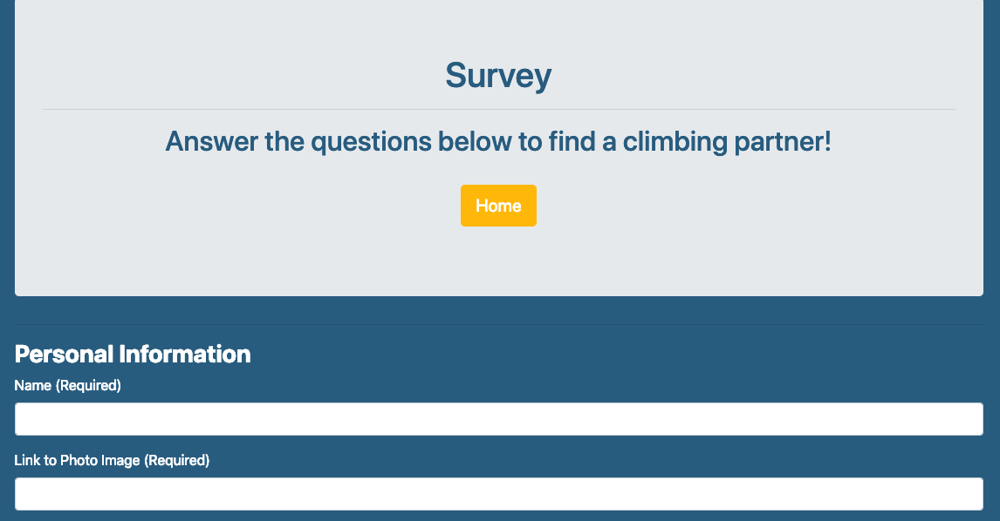

# Friend Finder - Node and Express deployed on Heroku

### Compatibility based application

-   The application will take in results from users' surveys then compare their results against all other users who have completed it. The application will then display the name and picture of the user with the best match overall to find you a suitable climbing partner!

*   The survey has 10 questions, answers to the survey questions are on a scale of 1-5 based on how much the user disagrees (1) or agrees (2).

## Technical details

-   The application uses ExpressJS to handle routing
-   The server.js file uses the npm packages: express and path.

-   The htmlRoutes.js file stores two routes:
    _ A GET Route to `/survey` which displays the survey page.
    _ A USE route that leads to `home.html` which displays the home page.

-   The `apiRoutes.js` file includes two routes:
    _ A GET route with the url `/api/friends`. This will be used to display a JSON of all possible friends
    _ A POST route `/api/friends`. This will be used to handle incoming survey results. This route will also be used to handle the compatibility logic.

    

*   Compatibility will be determined based on the following.
    _ Each user's results is converted into a simple array of numbers (ex: [5, 1, 4, 4, 5, 1, 2, 5, 4, 1]).
    _ Then will compare the difference between the user's scores against other users' scores, question by question. Then will add up the differences to calculate the `totalDifference`.
    _ Example:
    _ User 1: [5, 1, 4, 4, 5, 1, 2, 5, 4, 1]
    _ User 2: [3, 2, 6, 4, 5, 1, 2, 5, 4, 1]
    _ Total Difference: 2 + 1 + 2 = 5

*   The person with the closest match will be the one with the "least" amount of difference.

*   Once the closest match has been determined, it will display the result back to the user in the form of a modal pop-up.

-   The result will display both the name and picture of the closest match.

    
